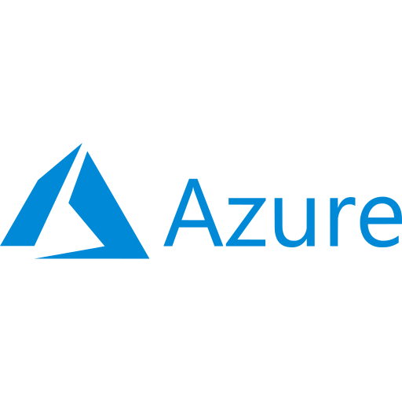
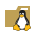

# Hey there, I'm Charles 👋
- 📻 I’m currently working towards my ham radio license!
- 🥅 2023 Goals: Contribute to open source projects.

### Connect with me:

    
    

### Check out my stats:

     
     
    

### Some of my favorite tools:

    
    
    
    
    
    
    
    
        
        </a>
        
        </a>
        
        </a>
        
        </a>
        
        </a>
        

