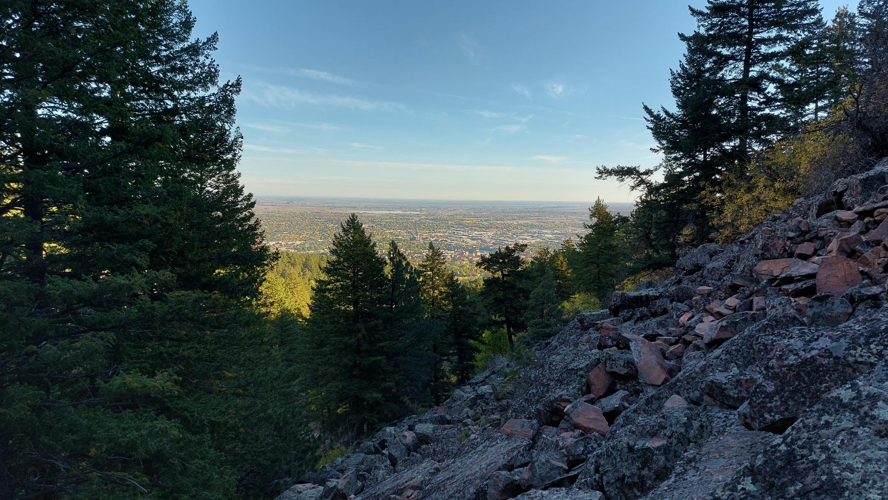

# Hey there, I'm Charles 👋

## I'm a Developer, and Student!
- 🌱 I’m currently working towards my ham radio license!
- 👯 I’m looking to collaborate on Open Source projects
- 🥅 2023 Goals: Contribute to open source projects.

### Connect with me:

    
    

### Check out my stats:

     
     
    

